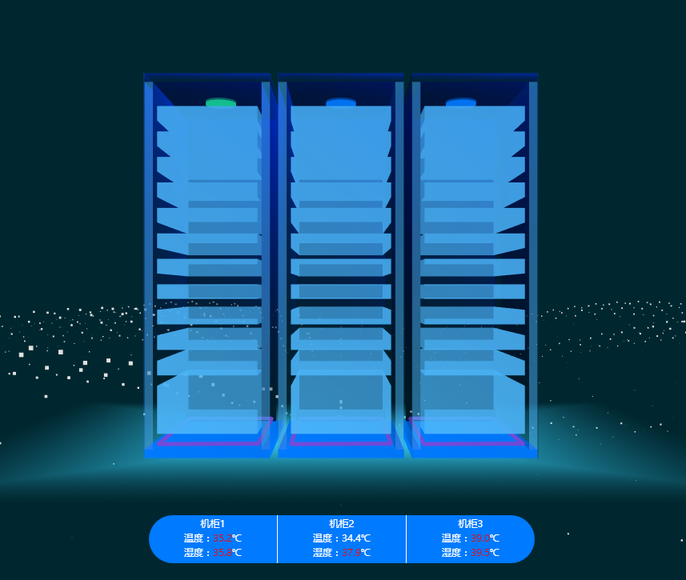
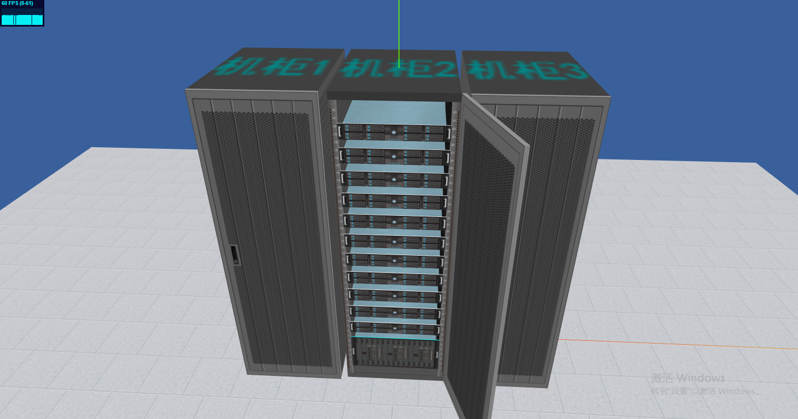

# Project
- 三连柜

## Project Start
- npm install

## Run Porject
- npm run dev
- port at 8000

## Project 打包成模块
- npm run lib
- 查看lib下的main.html设置内容

## Image

<!--  -->

## Demo form
- [three.js建立一个可交互的机房机柜](https://blog.csdn.net/zouhaodong/article/details/104071341)